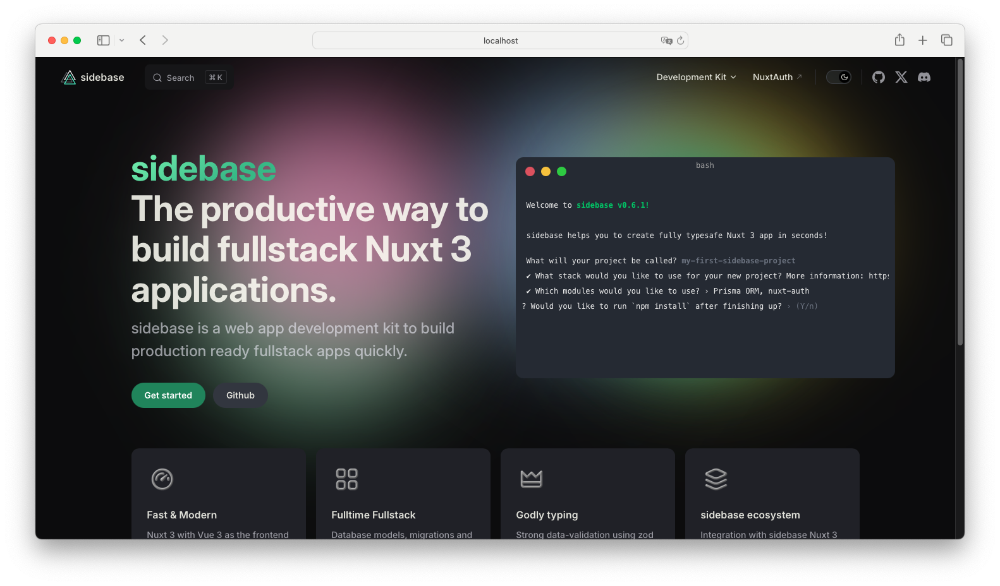

# sidebase docs

This is the mono-repo website of all `sidebase` projects.

## Quick start

1. Clone the repository
    ```sh
    git clone https://github.com/sidebase/docs
    ```
2. Install the dependencies
    ```sh
    npm ci
    ```
3. Start developing (with [docus](https://docus.dev)) at [localhost:3000](http://localhost:3000)
    ```sh
    npm run dev
    ```

## Contributing

In order to correctly edit the docs, please visit the respective module repository. These are currently:
- [sidebase/nuxt-auth](https://github.com/sidebase/nuxt-auth)
- [sidebase/nuxt-session](https://github.com/sidebase/nuxt-session)
- [sidebase/nuxt-parse](https://github.com/sidebase/nuxt-parse)

Once changes to the docs are merged into the `main` branch in the folder
`/docs/content` or `/docs/public` (for images and other media files), the changes will automatically
be merged into this repository and the website will be redeployed.

If you wish to edit the landing page or any blog entries, please open a PR on this repository.

Please note: There is a bug where the page may refuse to display changes properly. If this happens please remove the `.nuxt` folder.

```sh
rm -R .nuxt
```

## Blog

The new sidebase homepage allow for blog entries. Use the following template to create a new post:

```md
---
layout: post
title: Set your title here.
description: Add a short description.
image: Link a preview image
timestamp: 1669502269

author: The authors name
position: The authors position in sidebase 
avatar: A link to an avatar of the author
avatarLink: https://sidebase.io

published: false
---

Add your markdown content here!
```
The template can also be directly copied from `~/content/5.blog/posts/1.template.md`

Variables:
- layout - must be post to get correct page layout
- title - The title of your post. This will be displayed on the blog overview page
- description - A short description of what your post is about
- image - A preview image used to attract readers attention (size: 366px by 192px)
- timestamp - The timestamp of publishing. It must be a timestamp, to correctly display the publishing order of the posts. See current timestamp [here](https://www.currenttimestamp.com/).
- author - The name of the author
- position - The position of the author within sidebase (or another organisation)
- avatar - A link to an avatar of the user
- avatarLink - A link with which you can contact the author. Avatar and name is clickable
- published - Must be set to `true`, otherwise the post will not be shown on the overview page. Can however still be accessed with the link.

After writing your post, please move it to `~/content/5.blog/posts`. The name of your file, will become the url slug.
A file named `creating-your-first-sidebase-project.md` will be accessible on `https://sidebase.io/blog/posts/creating-your-first-sidebase-project`.

Therefore, try to be descriptive with your slugs to ensure users can preview what the article will be about, just by the link.

